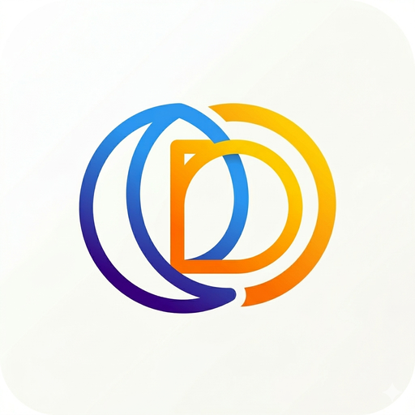

<p align="center">
  
</p>

# Dia a Dia

Dia a Dia é um aplicativo Android nativo desenvolvido em Kotlin para registrar reflexões pessoais, acompanhar a rotina e manter um pequeno diário com autenticação e sincronização em nuvem.

O projeto utiliza Firebase Authentication para login com e-mail/senha e Google, Firebase Realtime Database para persistência remota, Firebase Storage para fotos de perfil, e armazenamento local em SharedPreferences para manter sessão, perfil e reflexões mesmo offline.

## Sobre o Projeto

O aplicativo foi pensado como um diário pessoal completo, com fluxo direto e interface focada em escrita. Após a autenticação, o usuário acessa uma tela inicial com saudação personalizada, data atual, frase motivacional do dia (via API), e histórico de reflexões registradas com foto e localização. Também é possível editar o perfil com foto, criar e editar reflexões, e receber notificações de lembrete.

## Funcionalidades Implementadas

### Autenticação
:heavy_check_mark: Cadastro com e-mail e senha\
:heavy_check_mark: Login com e-mail e senha\
:heavy_check_mark: Login e cadastro com Google\
:heavy_check_mark: Recuperação de senha por e-mail (esqueci minha senha)

### Dados e Persistência
:heavy_check_mark: Persistência de perfil no Firebase Realtime Database\
:heavy_check_mark: Persistência de reflexões no Firebase Realtime Database\
:heavy_check_mark: Upload de foto de perfil no Firebase Storage\
:heavy_check_mark: Foto de capa salva em base64 no Realtime Database\
:heavy_check_mark: Cache local de sessão, perfil e reflexões (SharedPreferences)\
:heavy_check_mark: Leitura offline dos dados salvos no dispositivo

### Reflexões (Cadastro)
:heavy_check_mark: Criação de reflexões com texto obrigatório\
:heavy_check_mark: Upload de foto na reflexão (câmera ou galeria) salva em base64\
:heavy_check_mark: Captura automática de localização via GPS\
:heavy_check_mark: Listagem de reflexões na home com RecyclerView\
:heavy_check_mark: Edição de reflexão ao clicar no item da lista

### Fragments
:heavy_check_mark: Lista de reflexões como Fragment (ReflectionListFragment)\
:heavy_check_mark: Fragment de botão reutilizável (ButtonFragment)\
:heavy_check_mark: Fragment de input de senha (PasswordInputFragment)\
:heavy_check_mark: Fragment de input de e-mail (EmailInputFragment)

### Consumo de API
:heavy_check_mark: Consumo de API REST com Retrofit + Gson\
:heavy_check_mark: Exibição de frase motivacional do dia (ZenQuotes API)

### Notificações
:heavy_check_mark: Background Notification com WorkManager (lembrete diário)\
:heavy_check_mark: Push Notification com Firebase Cloud Messaging (FCM)\
:heavy_check_mark: Inscrição automática no tópico `daily_reflections`

### Monitoramento e Monetização
:heavy_check_mark: Firebase Analytics com eventos de login, cadastro, reflexão e perfil\
:heavy_check_mark: Firebase Crashlytics para monitoramento de crashes\
:heavy_check_mark: AdMob com banner na tela principal\
:heavy_check_mark: Firebase App Distribution configurado para distribuição de builds

### Internacionalização
:heavy_check_mark: Suporte a Português (BR) - idioma padrão\
:heavy_check_mark: Suporte a Inglês (EN)

## Telas Principais

- **Login**: autenticação com e-mail/senha, acesso com Google e recuperação de senha. Usa fragments de input de e-mail e senha.
- **Cadastro**: criação de conta com nome, e-mail e senha, além de cadastro com Google. Usa fragments de input e botão.
- **Home**: saudação personalizada, data atual, frase do dia (API), banner AdMob e lista de reflexões via Fragment.
- **Criar/Editar Reflexão**: formulário com upload de foto (câmera/galeria em base64), localização GPS e campo de texto.
- **Editar Perfil**: atualização do nome e foto de perfil (upload para Firebase Storage).

## Tecnologias

| Tecnologia | Uso |
|------------|-----|
| **Kotlin** | Linguagem principal |
| **Android SDK (API 30-36)** | Plataforma |
| **Firebase Auth** | Autenticação e-mail/senha e Google |
| **Firebase Realtime Database** | Persistência de perfil e reflexões |
| **Firebase Storage** | Upload de foto de perfil |
| **Firebase Cloud Messaging** | Push notifications |
| **Firebase Analytics** | Rastreamento de eventos |
| **Firebase Crashlytics** | Monitoramento de crashes |
| **Firebase App Distribution** | Distribuição de builds |
| **Retrofit + Gson** | Consumo de API REST |
| **WorkManager** | Notificações em background |
| **Google Play Services (Location)** | Localização GPS |
| **Google AdMob** | Monetização com anúncios |
| **Material Components** | Interface e componentes UI |
| **SharedPreferences** | Cache local offline |
| **Glide** | Carregamento de imagens |
| **CircleImageView** | Avatar circular |
| **Appwrite SDK** | Backend alternativo |

## Requisitos

Antes de executar o projeto, tenha instalado:

- Android Studio atualizado
- JDK 11
- SDK Android com API 36
- Um emulador Android ou dispositivo físico com Android 11 ou superior
- Uma conta Firebase configurada para o projeto

## Configuração do Ambiente

### 1. Variáveis de ambiente

Copie o arquivo `.env.example` para `.env` e preencha com suas credenciais:

```bash
cp .env.example .env
```

O arquivo `.env` contém as seguintes variáveis:

| Variável | Descrição |
|----------|-----------|
| `APPWRITE_ENDPOINT` | URL do endpoint Appwrite |
| `APPWRITE_PROJECT_ID` | ID do projeto Appwrite |
| `APPWRITE_DATABASE_ID` | ID do banco de dados Appwrite |
| `APPWRITE_STORAGE_ID` | ID do storage Appwrite |
| `QUOTE_API_BASE_URL` | URL base da API de frases (ZenQuotes) |
| `ADMOB_APP_ID` | ID do app AdMob |
| `ADMOB_BANNER_ID` | ID do banner AdMob |
| `FIREBASE_DATABASE_URL` | URL do Firebase Realtime Database |
| `FIREBASE_STORAGE_BUCKET` | Bucket do Firebase Storage |

### 2. Configuração do Firebase

1. Crie um projeto no Firebase Console.
2. Cadastre um app Android com o pacote `dev.victorbreno.diaadia`.
3. Baixe o arquivo `google-services.json` e coloque em `app/google-services.json`.
4. Ative o provedor **Authentication** com E-mail/Senha.
5. Ative também o provedor **Google** em Authentication.
6. Adicione o SHA-1 e SHA-256 do app no console do Firebase para liberar o Google Sign-In.
7. Crie a estrutura do **Realtime Database**.
8. Ative o **Firebase Storage** para upload de fotos.
9. Ative o **Firebase Analytics** (habilitado por padrão).
10. Ative o **Firebase Crashlytics** no console.
11. Configure o **Firebase Cloud Messaging** para push notifications.
12. Configure o **Firebase App Distribution** para distribuir builds.

Se o login com Google exibir erro de configuração ausente, normalmente isso indica que o arquivo `google-services.json` está desatualizado ou que o SHA-1 ainda não foi cadastrado no Firebase.

## Como Executar

### Android Studio

1. Clone o repositório.
2. Copie `.env.example` para `.env` e preencha as variáveis.
3. Abra a pasta do projeto no Android Studio.
4. Aguarde a sincronização do Gradle.
5. Confirme que o arquivo `google-services.json` está presente em `app/`.
6. Execute o app em um emulador ou dispositivo físico.

### Linha de comando

```bash
git clone <url-do-repositorio>
cd dia-a-dia-app
cp .env.example .env
./gradlew assembleDebug
```

Para instalar em um dispositivo ou emulador já conectado:

```bash
./gradlew installDebug
```

### Distribuir via App Distribution

```bash
./gradlew appDistributionUploadDebug
```

## Estrutura do Projeto

```text
app/
├── src/main/java/dev/victorbreno/diaadia/
│   ├── activities/       # Telas principais (Login, Register, Main, Reflection, Settings)
│   ├── adapters/         # ReflectionAdapter para RecyclerView
│   ├── api/              # Retrofit client e interface da API de frases
│   ├── data/             # Modelos (DiaryProfile, ReflectionEntry, Quote)
│   ├── fragments/        # Fragments reutilizáveis (Email, Password, Button, ReflectionList)
│   ├── notifications/    # Push notifications (FCM), background notifications (WorkManager)
│   ├── services/         # Firebase, Appwrite, Analytics, armazenamento local
│   └── utils/            # Validações e utilitários
├── src/main/res/         # Layouts, cores, temas, drawables e strings (PT-BR e EN)
└── build.gradle.kts      # Configuração do módulo Android
```

## Fluxo de Dados

- A autenticação é feita com Firebase Authentication.
- Os dados de perfil e reflexões são salvos no Firebase Realtime Database.
- As fotos de perfil são enviadas para o Firebase Storage e salvas em base64 no Realtime Database.
- As fotos das reflexões são salvas em base64 no Realtime Database.
- O app mantém cópias locais de sessão, perfil e reflexões com SharedPreferences.
- Quando a leitura remota falha, o aplicativo recupera os dados salvos no dispositivo.
- A frase do dia é buscada via Retrofit na API ZenQuotes.
- Eventos do usuário são registrados no Firebase Analytics.
- Crashes são monitorados pelo Firebase Crashlytics.

## Comandos Úteis

```bash
./gradlew assembleDebug            # Build de debug
./gradlew assembleRelease          # Build de release
./gradlew installDebug             # Instalar no dispositivo
./gradlew appDistributionUploadDebug   # Distribuir via App Distribution
./gradlew test                     # Rodar testes
```
